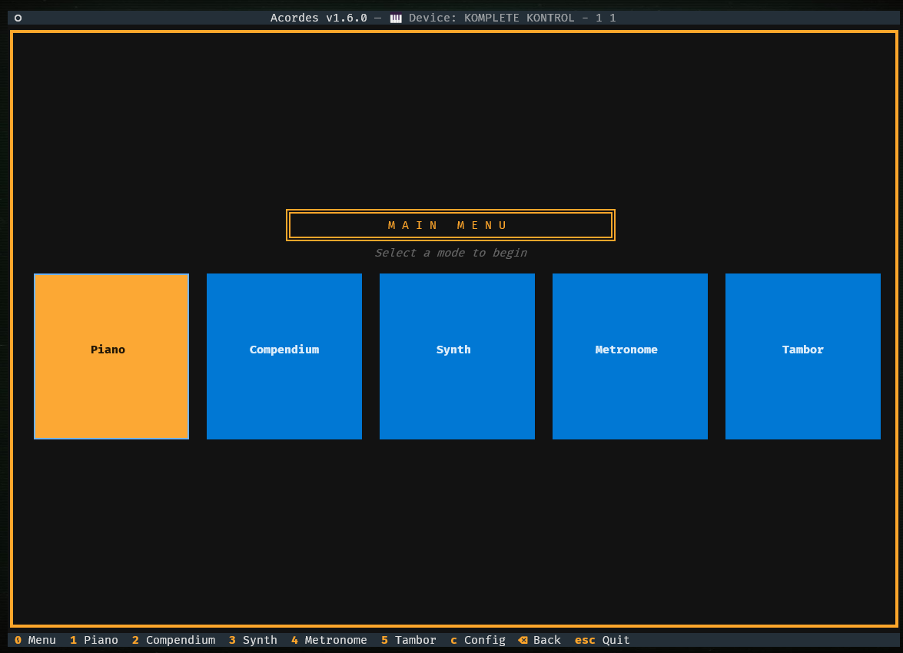
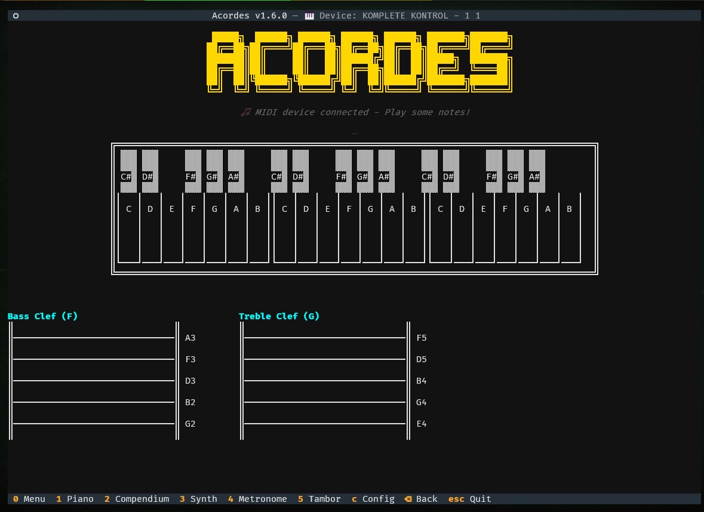
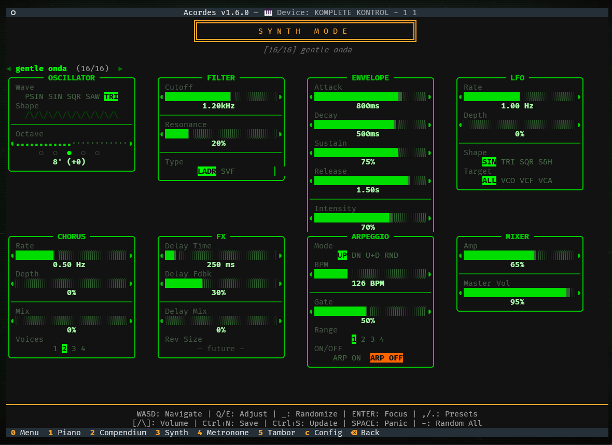
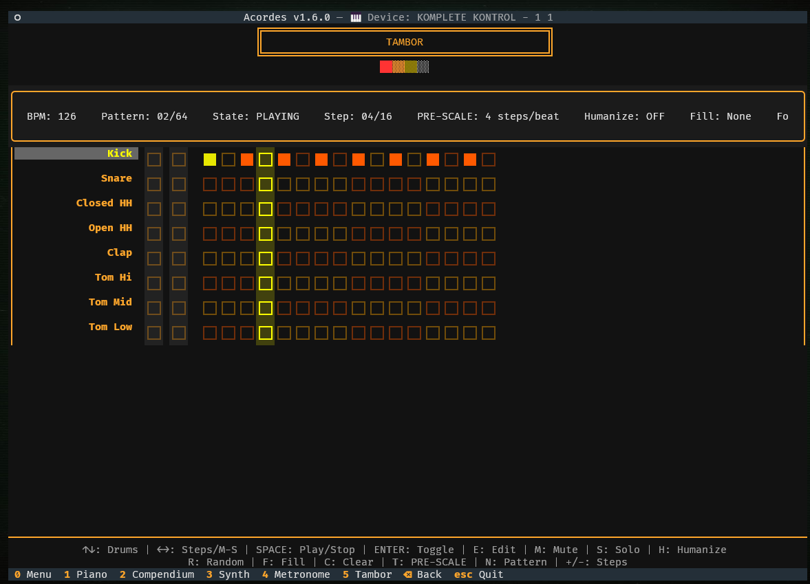

# Acordes - MIDI Piano TUI Application

## Application Overview

| | |
|:---:|:---:|
|  |  |
|  |  |

**Version 1.6.0**

A terminal-based MIDI piano application with real-time visualization, chord detection, traditional musical staff notation, a polyphonic synthesizer with a full signal-processing chain and preset system, and a fully-featured metronome.

## Features

- **Config Mode**: Display and select MIDI devices connected to your system.
- **Piano Mode**: Real-time visual piano keyboard showing notes and chord detection.
- **Synth Mode**: An 8-voice polyphonic synthesizer with real-time MIDI playback.
  - **Polyphonic Synthesis Engine** *(v1.3.0)*: Professional synthesis architecture with dual-oscillator design.
    - **Dual Rank Architecture**: Two independent synthesis paths per note.
    - **Series Filtering**: High-Pass Filter (HPF) into Low-Pass Filter (LPF) per rank.
    - **Sine Reinforcement**: Post-filter pure sine wave for solid low-end.
    - **Global Sub-Oscillator (LFO)**: Modulates VCO (Pitch), VCF (Filter), and VCA (Volume) across all voices.
  - **Performance Optimizations** *(v1.3.0)*: Full NumPy and SciPy vectorization for ultra-low CPU usage.
  - **MIDI Expressivity** *(v1.3.0)*: Support for MIDI Note-Off (Release) Velocity.
  - **Master Section** *(v1.3.0)*: Post-saturation Master Volume control with smooth gain protection.
  - **DSP Correctness & Click-Free Polyphony** *(v1.4.0)*: Full audio engine audit and fix — filter stability, sine waveform accuracy, phase continuity, gain staging, and polyphonic click elimination.
  - **Audio Thread Priority & Race-Free Parameters** *(v1.4.1)*: OS-level audio thread scheduling (Windows/Linux/macOS) and thread-safe parameter routing via event queue eliminate remaining clicks and crackles during rapid playing and mode switching.
  - **Low-Frequency Onset & Randomize Click Suppression** *(v1.4.3)*: Frequency-adaptive onset ramp, ANTI_I window, and DC blocker coefficient eliminate onset thumps on very low notes; output mute gate suppresses clicks during randomize on held notes.
  - **LFO Shape & Target Routing**: SIN / TRI / SQR / S&H shapes with target routing to VCO, VCF, VCA, or ALL simultaneously.
  - **FX Delay**: Stereo echo with adjustable time (50 ms – 2 s), feedback, and wet/dry mix.
  - **BBD-style Chorus**: Tape-emulation chorus with 1–4 modulated delay taps, rate, depth, and wet/dry mix.
  - **Arpeggiator**: Audio-callback-driven arpeggiator with UP / DOWN / UP+DOWN / RANDOM modes, BPM (shared with Metronome), gate length, and octave range 1–4.
  - **Preset System**: 10 factory presets + unlimited user-saveable presets stored as individual JSON files.
  - **Randomizer**: Generate musically useful random patches with a single key press.
- **Chord Compendium**: Reference guide with all chord types across all musical keys.
  - **Audio Playback**: Hear chords played as you browse.
- **Metronome Mode**: A highly customizable and musically aware metronome with BPM shared across all modes.

## What's New in v1.6.0

A comprehensive expansion of the Compendium Music Knowledge Hub with real-time search, 7 musical modes, hierarchically organized instruments, expanded genres and scales, and UI improvements.

### Compendium Expansion & Search Functionality

The Compendium has grown from 244 to 258+ music items across 6 main categories, and now features **real-time search** that instantly filters results as you type.

**Search Features:**
- **Real-time filtering**: Type in the search input at the top of Compendium Mode — the tree updates on every keystroke
- **Comprehensive scope**: Searches all fields including item names, descriptions, details, examples, and metadata
- **Grouped results**: Search results are organized by category (Chords, Scales, Modes, Instruments, Genres) with item counts
- **Keyboard-friendly**: Tab/Shift+Tab cycling between search input and tree — no mouse needed
- **Clear to restore**: Deleting all search text instantly restores the full hierarchical tree
- **Auto-play integration**: Existing chord auto-play and detail panel work seamlessly with search results

**Category Details:**
- **Browse categories**: Select major categories (Chords 🎹, Scales 📊, Modes 🎼, Instruments 🎸, Genres 🎧) to view their descriptions
- **Subcategory information**: The detail panel shows all subcategories under each parent category for quick reference
- **Visual icons**: Each category displays a unique icon for easy visual identification throughout the interface

**Total items in Compendium:**
- Chords: 180 items (12 keys × 15 chord types)
- Scales: 15 items (was 7, added 8 exotic scales)
- Modes: 7 items (NEW category)
- Instruments: 28 items (was 6, expanded with family grouping)
- Genres: 22 items (was 6, added 16 new genres)
- **Total: 258+ music theory items**

### 7 Music Modes (NEW Category)

Complete reference for all diatonic modes derived from the major scale:
- **Ionian** (1st degree) — Bright, happy, resolved (identical to major scale)
- **Dorian** (2nd degree) — Minor, jazzy, funky, groovy
- **Phrygian** (3rd degree) — Dark, exotic, mysterious, Spanish (flamenco)
- **Lydian** (4th degree) — Ethereal, dreamy, bright, floaty
- **Mixolydian** (5th degree) — Major with bluesy, unresolved quality
- **Aeolian** (6th degree) — Sad, introspective, minor, dark (natural minor)
- **Locrian** (7th degree) — Very dark, dissonant, unsettling, unstable

Each mode includes intervals, semitone patterns, usage examples, and related modes.

### Expanded Instruments with Family Hierarchy (22 → 28 items)

Instruments now organized into 6 hierarchical families:

**String Instruments (10):** Piano, Acoustic/Electric Guitar, Violin, Cello, Viola, Double Bass, Harp, Mandolin, Ukulele, Bass Guitar

**Brass Instruments (4):** Trumpet, French Horn, Trombone, Tuba

**Woodwind Instruments (4):** Saxophone, Clarinet, Flute, Oboe

**Percussion Instruments (1):** Drums / Drum Kit

**Keyboard Instruments (3):** Organ, Synthesizer, (Piano also listed here)

**Vocal Instruments (1):** Vocals / Human Voice

Each instrument includes detailed descriptions, range, polyphony limits, learning curve, artist examples, and metadata.

### Expanded Genres (6 → 22 items)

Added 16 new genres to the original 6:

**Original:** Jazz, Blues, Rock, Classical, Pop, Hip Hop / Rap

**New:** Country, Folk, Reggae, Electronic / EDM, Metal, R&B / Soul, Funk, Latin / Salsa, Gospel, Ambient, Indie / Alternative, Punk, Disco, World / Ethnic Music, Ska, Grunge

Each genre includes era, origin, key characteristics, primary instruments, and subgenres.

### Expanded Scales (7 → 15 items)

Original 7 scales plus 8 exotic/modal variations:

**Original:** Major Scale, Natural Minor, Harmonic Minor, Melodic Minor, Major Pentatonic, Minor Pentatonic, Blues Scale

**New Exotic Scales:** Harmonic Major, Whole Tone Scale, Phrygian Dominant, Diminished Scale (Octatonic), Augmented Scale, Altered Scale (Super Locrian), Mixolydian Flat 6 (Hindu), Neapolitan Minor

### Command Palette Disabled

The Textual command palette (Ctrl+\) has been disabled for a cleaner, more focused keyboard interface. All essential mode switching and commands are available via the global key bindings (0–5, C for config, ESC to quit).

---

## What's New in v1.5.0

A major signal-chain expansion adding four fully-interactive processing sections to the synthesizer.

### LFO Shape & Target Routing
The LFO section is now a complete modulation bus. Choose from **SIN** (sine), **TRI** (triangle), **SQR** (square), or **S&H** (sample & hold — a random value latched each period). Set `Depth` (master modulation amount) and route it to **ALL**, **VCO** (pitch vibrato), **VCF** (filter sweep), or **VCA** (tremolo).

### FX Delay
Stereo ping-pong delay with per-sample feedback loop. `Delay Time` (50 ms–2 s), `Delay Fdbk` (0–90%), and `Delay Mix` (dry/wet). Fully bypassed at mix=0 with zero CPU overhead. *Rev Size* placeholder shown in the UI for a future reverb implementation.

### BBD-style Chorus
Tape-emulation chorus with a single shared ring buffer and 1–4 modulated read taps (each 90° apart in LFO phase for natural stereo spread). Controls: `Rate` (0.1–10 Hz), `Depth` (0–25 ms modulation swing), `Mix` (wet/dry), `Voices` (1–4 taps). Bypassed at mix=0.

### Arpeggiator
Sample-accurate audio-callback arpeggiator. Hold any combination of keys; the arpeggiator cycles through them in the selected pattern. Modes: **UP**, **DOWN**, **UP+DOWN** (bounce), **RANDOM**. `BPM` is shared with the Metronome — change it in either mode and both update. `Gate` (5–100% note-on fraction per step), `Range` (1–4 octave span). Toggle on/off without losing held notes.

---

## What's New in v1.4.3

A DSP quality patch focused on two categories of audible artifacts in the synth engine.

### Low-Frequency Onset Thump Elimination
Very low notes (sine, octave=-2, short attack) previously produced an audible thump on onset because the DC blocker's settling transient (≥66 ms at 55 Hz) was far longer than the fixed 3 ms onset ramp.

- **Frequency-adaptive onset ramp** (`ONSET_RAMP`): Duration now scales with the note's fundamental period — `1.5 × period_ms`, clamped [3 ms, 30 ms]. At 55 Hz (octave=-2) this is 27 ms; at 440 Hz it stays 3 ms (no regression).
- **Frequency-adaptive ANTI_I**: The envelope soft-start window matches the onset ramp duration, so the envelope attenuation covers the full DC blocker settling period at low frequencies.
- **Adaptive DC blocker coefficient**: The pole frequency now adapts to the voice's fundamental — `coeff=0.9990` above 100 Hz (standard 2.4 Hz pole), linearly interpolated to `coeff=0.9997` below 50 Hz (0.7 Hz pole). This reduces phase distortion at very low fundamentals without affecting mid/high notes.

### Randomize Click Suppression
Pressing `-` (randomize) while holding notes previously caused an audible click because `waveform`, `octave`, and envelope parameters were applied instantly via `setattr` mid-note.

- **Output mute gate** (`mute_gate` event): A ~8 ms (384-sample) fade-out/fade-in gate is enqueued before the parameter update. The engine fades to silence before the new waveform/octave/envelope take effect, then fades back in — eliminating the discontinuity transient on held notes.
- Rapid repeated randomize presses re-arm the gate cleanly; randomize during silence is inaudible.

---

## What's New in v1.4.1

A focused audio reliability patch targeting the remaining click and crackle sources during rapid playing, mode switching, and parameter changes.

### OS Audio Thread Priority
The PortAudio callback thread is now given elevated OS scheduling priority at startup, preventing the Textual UI thread from starving it during widget rebuilds (mode switches). All three platforms are covered:
- **Windows**: `SetPriorityClass(ABOVE_NORMAL_PRIORITY_CLASS)` — no admin rights required.
- **Linux**: `SCHED_FIFO` real-time scheduling via `pthread_setschedparam` + `PR_SET_TIMERSLACK` for tighter timer granularity. Falls back to `os.nice(-10)` if permissions are insufficient.
- **macOS**: Mach `thread_policy_set(THREAD_TIME_CONSTRAINT_POLICY)` — the same API used by Core Audio internally. Falls back to `os.nice(-10)` if the call fails.

### Thread-Safe Parameter Updates
`update_parameters()` and `all_notes_off()` previously wrote directly to shared attributes from the Textual UI thread while the audio callback read them simultaneously — a live data race on 25+ fields. Both now route through the existing MIDI event queue and are applied on the audio thread at the next buffer boundary, eliminating all cross-thread torn-read clicks when moving knobs or switching modes.

### Gain Continuity Improvements
- **Pre-counted voice polyphony**: Voice count is calculated before mixing so the gain ramp targets the correct value for the current buffer rather than lagging one buffer.
- **Smooth silence decay**: `master_gain` now decays smoothly back to 1.0 during silence instead of snapping instantly, preventing a level spike on the first buffer of the next note.
- **Faster gain tracking**: Smoothing coefficient tightened (`0.98 → 0.80`) so gain tracks voice-count changes within ~2 buffers (~10 ms).

### Per-Voice Onset Ramp
A 3 ms linear fade-in is applied to each voice's signal before the DC blocker on every new trigger. The DC blocker resets to zero at note onset — without this ramp, its differentiator output on the first samples can amplify large signal steps into a high-frequency click, especially with square and sawtooth waveforms at non-zero oscillator phases.

### Envelope Refinements
- **ANTI_I extended 2 ms → 5 ms**: Covers the full DC blocker settling window. Applied unconditionally within the onset window (previously skipped if the buffer boundary fell past 2 ms from note-on).
- **ANTI_I repositioned after CROSS**: Stolen voices still crossfade from their pre-steal level; ANTI_I only attenuates, never raises, so both mechanisms compose correctly.

### Piano Mode Fix
Restored correct `on_mount` / `on_unmount` structure — a linter had moved `set_interval` and display initialisation into `on_unmount`, causing Piano Mode to have no sound or visual display on first visit.

---

## What's New in v1.4.0

A focused DSP quality release — no new features, only fixes to audio engine correctness, polyphonic click elimination, and UI accuracy.

### Audio Engine Correctness
- **IIR Filter rebuilt**: Resonance feedback was warping the pole coefficient, causing instability at high resonance. Now uses the correct 1-pole topology — stable and musical at all settings.
- **Sine waveform fixed**: The "warm sine" Taylor approximation was operating at `±π` (outside its convergence radius), producing heavy distortion. Replaced with `sin()` + 1% 2nd harmonic blend.
- **Filter keyboard tracking corrected**: The octave transpose was being applied twice in filter tracking. Fixed to use the pre-octave base frequency.
- **HPF/LPF cancellation guard**: Under certain velocity + tracking conditions the HPF could exceed the LPF, silencing the voice. HPF is now always capped at least one octave below the LPF.
- **Sub-oscillator phase continuity**: The sine-reinforcement oscillator was restarting from a stale phase every buffer, producing a periodic click. Now uses a dedicated per-voice phase accumulator.
- **Release time corrected**: A `/4` divisor in the release time constant was making release 4× shorter than the UI value. Removed — the slider now means what it says.
- **Gain staging corrected**: Master Volume is now applied before `tanh()` soft-clipping so it controls drive into the clipper, not just output level.

### Click-Free Polyphony
- **Polyphony gain ramp**: The per-voice gain compensation (`1/√N`) previously jumped in a single buffer when voices were added or removed, causing an audible click. Now ramps smoothly over ~25 ms.
- **Voice steal crossfade**: Extended from 3 ms (exponential) to 8 ms (linear) — stolen voices dissolve into new attacks without a pop.
- **Sine wrap-point tick**: The old 2% sawtooth blend in "warm sine" caused a discontinuity at each phase-rollover, audible as a periodic tick on low notes. Replaced with a 2nd-harmonic sine blend.
- **DC blocker reset on steal**: Filter and DC-blocker state from a stolen voice no longer bleeds into the new note's onset.

### Stereo Image
- **Symmetric pan spread**: All 8 voices now spread symmetrically around centre in equal steps (±15%, ±10%, ±6%, ±2%) — previously only voices 0–1 had meaningful stereo width.

### UI Fixes
- MIXER section Amp label corrected from `"Preset [up/down]"` to `"Amp [↑/↓]"`.
- Envelope time display now shows milliseconds for all values below 1 s (was switching at 10 ms).

---

## What's New in v1.3.0

- **Synthesis Architecture**:
  - Implemented the Dual Rank system where each key triggers two independent synth engines.
  - Added Series HPF -> LFO filtering for precise timbral windowing.
  - Added Sine Reinforcement to maintain bass "heft" during aggressive filtering.
  - Global Sub-Oscillator (LFO) for authentic modulation.
- **Pro Audio Improvements**:
  - **8-Voice Polyphony**: Professional polyphonic synthesis with strict voice management.
  - **Vectorized DSP**: All oscillators, filters, and envelopes refactored with NumPy/SciPy for high performance.
  - **Click-Free Performance**: Implemented free-running oscillators and smoothed gain transitions.
  - **DC Blocker Refinement**: Eliminated "DC Crush" artifacts for rock-solid tonal stability.
- **Master Section**:
  - New Master Volume control (post-saturation) using **[** and **]** keys.
  - Redesigned MIXER UI section showing both Preset and Master levels.
- **MIDI Expressivity**:
  - Full support for MIDI Release Velocity, allowing key release speed to modulate the sound.

## Requirements

- **Python 3.11 or 3.12 recommended** (see note below)
- MIDI input device (MIDI keyboard, controller, or virtual MIDI device)
- PyAudio, SciPy & NumPy (for high-performance Synth playback)
- Pygame (for Metronome audio playback)

> **Python version note:** PyAudio and python-rtmidi publish pre-built Windows
> wheels only up to Python 3.12. On Python 3.13 or 3.14 pip will try to compile
> these from source, which requires the Visual Studio Build Tools C++ compiler.
> If you hit install errors, the easiest fix is to switch to Python 3.12:
> https://www.python.org/downloads/

## Installation

The launcher scripts handle everything automatically — just run them and they
will create a virtual environment and install all dependencies on first launch.

**Windows (Command Prompt):**
```cmd
run.bat
```

**Windows (PowerShell):**
```powershell
.\run.ps1
```

**Linux / macOS:**
```bash
./run.sh
```

> The Windows launchers prefer Python 3.12 or 3.11 automatically when both are
> installed alongside a newer version. See the Troubleshooting section if
> installation fails.

## Usage

### Running the app

| Platform | Command |
|---|---|
| Windows (CMD) | `run.bat` |
| Windows (PowerShell) | `.\run.ps1` |
| Linux / macOS | `./run.sh` |

Manual launch after the venv is set up:
```bash
# Windows
venv\Scripts\python.exe main.py

# Linux / macOS
./venv/bin/python main.py
```

### Keyboard Controls

#### Global

| Key | Action |
|---|---|
| **1** | Piano Mode |
| **2** | Compendium Mode |
| **3** | Synth Mode |
| **4** | Metronome Mode |
| **C** | Config Mode |
| **Escape** | Quit (with confirmation) |

#### Synth Mode — Presets & Utility

| Key | Action |
|---|---|
| **,** / **.** | Previous / Next preset |
| **Ctrl+N** | Save as new preset |
| **Ctrl+S** | Overwrite current preset |
| **-** | Randomize all parameters |
| **Space** | Panic — silence all voices |

#### Synth Mode — Focus navigation (press Enter to enter / exit)

In focus mode a parameter cell is highlighted. WASD moves the cursor;
Q/E change the highlighted value.

| Key | Action |
|---|---|
| **Enter** | Enter / exit focus mode |
| **Escape** | Exit focus mode |
| **W / S** | Move cursor up / down |
| **A / D** | Move cursor left / right |
| **Q** | Decrease focused parameter |
| **E** | Increase focused parameter |
| **_** (Shift+−) | Randomize focused parameter |

#### Synth Mode — Legacy keys (unfocused, no MIDI keyboard needed)

| Key | Action |
|---|---|
| **Q / W** | Octave down / up |
| **E / D** | Filter cutoff down / up |
| **R / F** | Resonance down / up |
| **T / G** | Attack down / up |
| **Y / H** | Decay down / up |
| **U / J** | Sustain down / up |
| **I / K** | Release down / up |
| **O / L** | Intensity down / up |
| **[ / ]** | Master volume down / up |
| **↑ / ↓** | Amp level up / down |

#### Metronome Mode

| Key | Action |
|---|---|
| **P / Space** | Start / stop |
| **↑ / ↓** | Tempo up / down (BPM) |
| **← / →** | Cycle time signature |

#### Config / Compendium Mode

| Key | Action |
|---|---|
| **Arrow Keys** | Navigate |
| **Enter** | Select / expand |
| **Space** | Refresh device list (Config only) |

### Modes

#### Config Mode
- View all available MIDI input devices
- Select a device to use for Piano Mode
- Press Space to refresh the device list

#### Piano Mode
- Visual 3-octave piano keyboard display
- Real-time note highlighting in red
- Automatic chord detection with smart recognition
- Chord names displayed centrally above the keyboard
- Side-by-side musical staff notation:
  - **Bass Clef (F)**: Displays notes below B3 (MIDI 59)
  - **Treble Clef (G)**: Displays notes B3 and above
  - Notes appear as yellow dots (●) on the staff lines
  - Sharp notes marked with ♯ symbol
  - Reference note labels on the right side of each staff

#### Compendium Mode
- Browse complete chord library
- All 12 keys (C through B)
- 15+ chord types per key
- View chord notes for reference

#### Synth Mode
- 8-voice polyphonic synthesizer with real-time MIDI playback
- **Preset System**: 10 factory presets + unlimited user presets saved in `presets/`
  - Cycle presets with `,` / `.`, save with **Ctrl+N**, update with **Ctrl+S**
  - Presets remembered across mode switches and app restarts
- **Randomizer**: Press `-` to instantly generate a new random patch
- **Oscillator**: Sine, Square, Sawtooth, and Triangle waveforms with octave transpose
- **Filter**: Low-pass filter with logarithmic cutoff (20Hz–20kHz) and resonance
- **Envelope**: Full ADSR (Attack, Decay, Sustain, Release) + Intensity
- **AMP**: Master volume with automatic waveform gain compensation
- **MIDI Controllers**: Pitch bend (±2 semitones) and modulation wheel (CC1)

#### Metronome Mode *(NEW in v1.1.0)*
- A large, centered visual "beat bar" shows the current beat in the measure.
- Cycle through common time signatures like 2/4, 3/4, 4/4, 6/8, and more.
- The metronome automatically applies the correct strong and weak accent patterns for each signature.
- The traditional Italian tempo name for the current BPM is always visible.

## Project Structure

```
acordes/
├── main.py                      # Application entry point
├── config_manager.py            # Configuration persistence (MIDI device, synth state, last preset)
├── components/                  # UI widgets
│   ├── piano_widget.py          # Visual piano keyboard
│   ├── chord_display.py         # Chord name display
│   ├── staff_widget.py          # Musical staff notation display
│   ├── header_widget.py         # Unified header/title widget
│   └── confirmation_dialog.py   # Quit confirmation
├── modes/                       # Screen modes
│   ├── config_mode.py           # MIDI device configuration
│   ├── piano_mode.py            # Real-time piano display
│   ├── compendium_mode.py       # Chord reference
│   ├── synth_mode.py            # Synthesizer interface with preset system
│   ├── metronome_mode.py        # Metronome interface
│   └── main_menu_mode.py        # Main menu
├── midi/                        # MIDI handling
│   ├── device_manager.py        # Device detection
│   └── input_handler.py         # MIDI input processing
├── music/                       # Music theory and synthesis
│   ├── chord_detector.py        # Chord recognition (supports 9th, 11th, 13th chords)
│   ├── chord_library.py         # Chord database
│   ├── synth_engine.py          # 8-voice polyphonic audio synthesis engine
│   └── preset_manager.py        # Synth preset load/save/cycle (NEW in v1.2.0)
├── presets/                     # Synth preset JSON files (NEW in v1.2.0)
│   ├── default.json             # Factory presets (10 total)
│   ├── warm_pad.json
│   ├── bright_saw_lead.json
│   └── ...                      # User presets saved here automatically
├── run.bat                      # Windows launcher (Command Prompt)
├── run.ps1                      # Windows launcher (PowerShell)
├── run.sh                       # Linux/macOS launcher
├── scripts/                     # Installation and setup scripts
└── docs/                        # Documentation and development notes
```

## Technology Stack

- **Textual**: Modern TUI framework
- **mido**: MIDI I/O library
- **python-rtmidi**: Real-time MIDI backend
- **mingus**: Music theory library
- **PyAudio**: Real-time audio I/O
- **Pygame**: Audio mixer for metronome sounds
- **NumPy**: Numerical computing for audio synthesis

## Troubleshooting

### Dependency install fails (Python 3.13 / 3.14)

PyAudio and python-rtmidi do not yet publish pre-built wheels for Python 3.13+.
`pip install` will attempt to compile them from C source, which requires the
**Visual Studio Build Tools** (a free download from Microsoft). If you don't
want to install a C compiler, the easiest solution is to use **Python 3.12**:

```
https://www.python.org/downloads/python-3.12.10/
```

You can have multiple Python versions installed side-by-side. After installing
3.12, delete the `venv/` folder and run `run.bat` / `run.ps1` again — the
launcher automatically prefers Python 3.12 over 3.13/3.14 when both are
installed (via the `py` launcher that ships with python.org installers).

### Audio Not Available (Synth / Metronome Mode)

If you have audio issues:

1. **Windows — PyAudio install fails:** try the pipwin method:
   ```cmd
   venv\Scripts\pip install pipwin
   venv\Scripts\pipwin install pyaudio
   ```

2. **Linux:** install the PortAudio system library first:
   ```bash
   sudo apt-get install portaudio19-dev python3-dev
   pip install pyaudio pygame
   ```

3. **macOS:** install PortAudio via Homebrew first:
   ```bash
   brew install portaudio
   pip install pyaudio pygame
   ```

### No MIDI Devices Found

1. Ensure your MIDI device is connected
2. On Linux, you may need to install ALSA MIDI support:
   ```bash
   sudo apt-get install libasound2-dev
   ```
3. On macOS, CoreMIDI should work out of the box
4. On Windows, ensure your MIDI device drivers are installed

### Permission Issues (Linux)

Add your user to the audio group:
```bash
sudo usermod -a -G audio $USER
```

Then log out and log back in.

## License

MIT License
