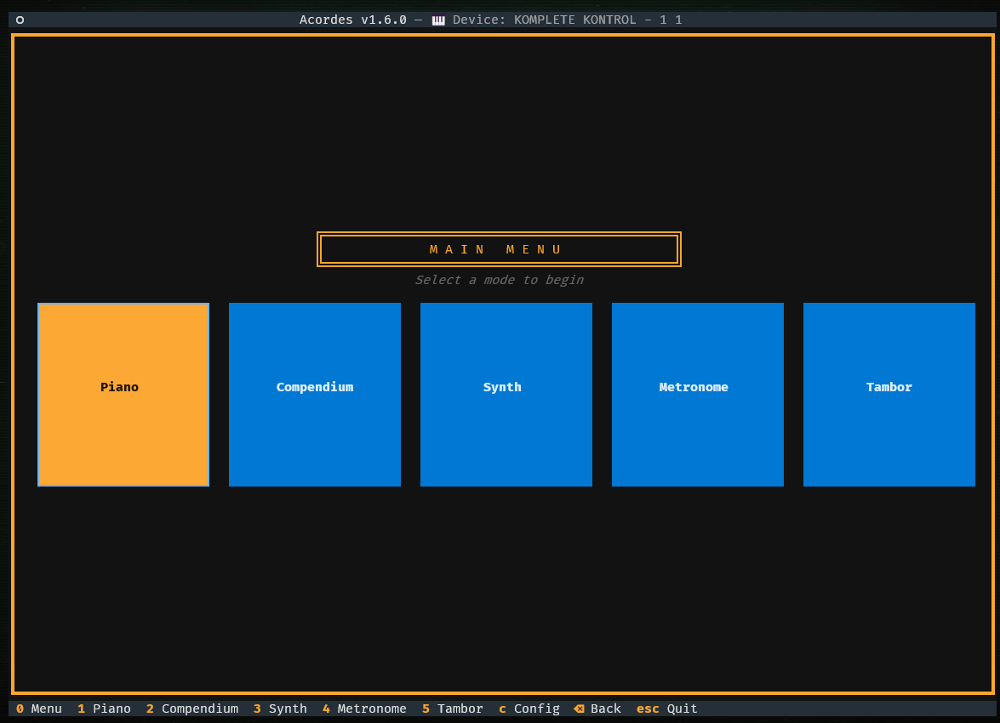
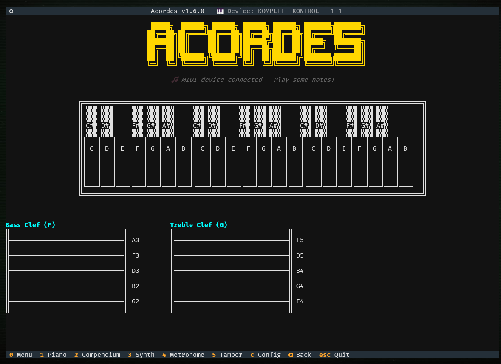
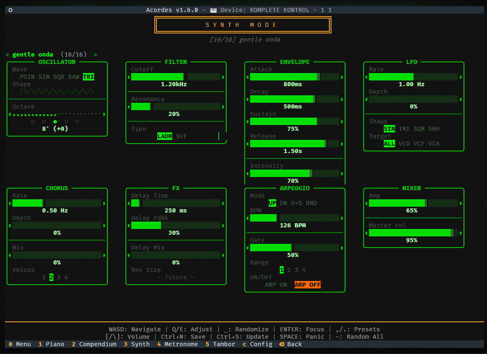
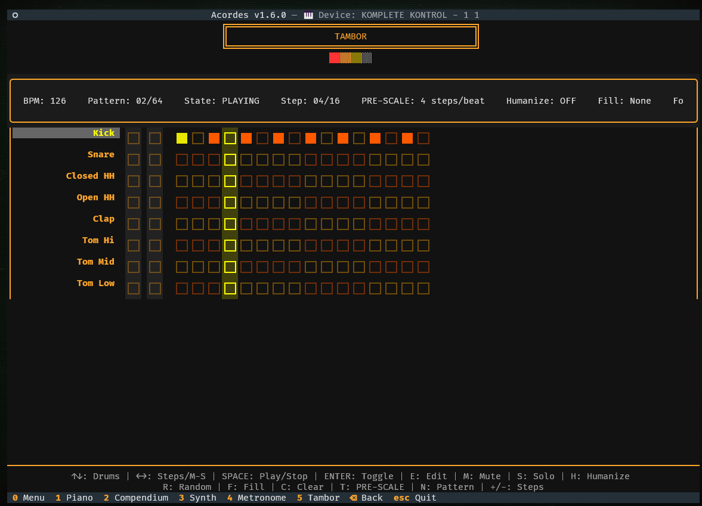

# Acordes: Polyphonic MIDI Synthesizer & Piano TUI

## Application Overview

| | |
|:---:|:---:|
|  |  |
|  |  |

---

## About This Project

**Acordes** is a professional-grade, terminal-based MIDI synthesizer and piano application built with Python. It combines real-time MIDI input processing with a full 8-voice polyphonic synthesizer, musical reference tools, and a 16-step drum machine sequencer.

Whether you're a musician exploring synthesis in the terminal, a developer interested in audio DSP, or someone seeking a lightweight alternative to heavyweight DAWs, Acordes offers:

- **Real-time MIDI Playback**: Connect any USB MIDI keyboard and play instantly
- **Professional Polyphonic Synthesis**: 8-voice synthesis engine with dual-rank architecture, dual filters per voice, and a complete signal chain (VCO → HPF → LPF → Sine Reinforcement → Envelopes → FX)
- **Preset System**: 128 professionally programmed factory presets + unlimited user-saveable presets
- **Effects Processing**: BBD-style chorus, stereo feedback delay, and parametric filtering
- **Arpeggiator**: Sample-accurate, audio-thread driven arpeggiator (UP / DOWN / UP+DOWN / RANDOM)
- **Percussion Synthesis**: Dedicated drum machine mode with 16-step sequencer and 8 drum sounds
- **Musical Reference Tools**: Complete chord compendium, real-time chord detection, traditional music notation (bass & treble clefs)
- **Metronome**: Musically aware metronome with correct accentuation for time signatures
- **Velocity Curves**: Adaptive velocity response (Linear, Soft, Normal, Strong, Very Strong)

**Latest Version**: 1.8.9

---

## Features

### Config Mode
- Display and select MIDI input devices
- Display and select audio output devices (Windows, macOS, Linux/ALSA)
- Configure velocity curve response (5 types: Linear, Soft, Normal, Strong, Very Strong)
- TAB to cycle between MIDI, Audio, and Velocity Curve sections

### Piano Mode
- Real-time visual 3-octave piano keyboard
- Live note highlighting
- Automatic chord detection and smart recognition
- Chord display above the keyboard
- Musical staff notation (side-by-side bass and treble clefs)

### Synth Mode: The Heart of Acordes
A full 8-voice polyphonic synthesizer with real-time MIDI playback:

**Synthesis Architecture**:
- **Dual Rank per Voice**: Two independent synthesis paths per note (Rank I & II)
- **Oscillators**: Sine, Square, Sawtooth, Triangle waveforms with PolyBLEP anti-aliasing and 4× internal oversampling
- **Dual-Filter Architecture**: MS-20 inspired HPF → LPF series (per rank) with selectable filter routing, soft saturation, per-stage resonance
- **Sine Reinforcement**: Post-filter sine wave for low-end solidity
- **Global LFO**: Modulates VCO (pitch), VCF (filter), and VCA (amplitude)

**Synthesis Parameters** (8 sections):
- **Oscillator**: Waveform, Octave (-2 to +2), Noise Level
- **Filter**: HPF/LPF Cutoff & Resonance, Filter Drive (0.5–8.0× pre-filter gain), Filter Routing (HP+LP / BP+LP / NT+LP / LP+LP), Key Tracking
- **Filter EG**: Independent envelope for filter modulation
- **Amp EG**: Amplitude envelope (ADSR)
- **LFO**: Shape (SIN/TRI/SQR/S&H), Rate, Depth, Target routing
- **Chorus**: BBD-style tape emulation, 1–4 voices, rate/depth/mix
- **FX**: Stereo delay (50 ms–2 s), feedback, wet/dry mix
- **Arpeggio**: UP / DOWN / UP+DOWN / RANDOM modes, BPM sync, gate length, octave range

**Effects & Processing**:
- **Chorus**: Tape-emulation with modulated multi-tap ring buffer
- **Delay**: Stereo ping-pong feedback delay with per-sample processing
- **Soft Clipping**: Smooth tanh saturation
- **DC Blocking**: Removes DC offset clicks
- **Crossfade**: 8-sample inter-buffer blending for click-free note transitions

**Audio Engine Quality**:
- **48 kHz sample rate** (professional audio standard)
- **Full vectorization**: NumPy/SciPy for ultra-low CPU usage
- **Click-free polyphony**: Smooth voice allocation, intelligent voice stealing
- **OS-level audio thread priority**: Elevated scheduling on Windows/Linux/macOS
- **Thread-safe parameter routing**: All changes via MIDI event queue
- **Sample-accurate timing**: Audio callback processes all MIDI events at buffer boundaries

**Preset System**:
- **Factory Presets**: 128 professionally programmed presets across 8 categories (Bass, Leads, Pads, Plucked, Seq, FX, Misc, Synth)
- **User Presets**: Unlimited custom presets saved as individual JSON files
- **Randomizer**: Generate musically useful random patches with the `-` key
- **Parameter Persistence**: All tweaks auto-saved to disk; last preset restored on restart

### Compendium Mode
A comprehensive music theory reference hub:
- **Chord Browser**: All 12 keys, 15+ chord types each
- **Scales & Modes**: Major, minor, harmonic, melodic, 7 diatonic modes, 15 exotic scales
- **Instruments**: 28 instruments organized by family (strings, brass, woodwinds, percussion, keyboard, vocal)
- **Genres**: 22+ musical genres with era, origin, characteristics, and subgenres
- **Real-time Search**: Filter all 258+ items instantly as you type
- **Chord Playback**: Hear chords as you browse

### Metronome Mode
- Large, visual beat bar display
- Customizable time signatures (2/4, 3/4, 4/4, 6/8, etc.) with musically correct accentuation
- Shared BPM with Arpeggiator
- Italian tempo markings (Andante, Allegro, Presto, etc.)

### Tambor Mode: Drum Machine
- **16-Step Sequencer**: Pattern-based drum programming
- **8 Drum Sounds**: Kick, Snare, Hi-Hats (open/closed), Clap, Toms (high/mid/low), Cowbell
- **64 Pattern Slots**: Save and recall your drum patterns
- **16 Fill Patterns**: Built-in fills with dynamic expansion
- **Controls**: Mute/solo, humanization, timing modes (straight/swing/shuffle)
- **BPM Sync**: Synchronized with metronome and arpeggiator

---

## Requirements

- **Python 3.11 or 3.12** (PyAudio and python-rtmidi lack pre-built wheels for 3.13+)
- **MIDI Input Device** (USB MIDI keyboard, controller, or virtual MIDI)
- **Audio Output** (system speakers or audio interface)

### Platform-Specific Audio Setup

**Windows**: PyAudio is included in the Windows installer via pipwin.
**Linux**: Install PortAudio library first:
```bash
sudo apt-get install portaudio19-dev python3-dev
```

**macOS**: Install PortAudio via Homebrew:
```bash
brew install portaudio
```

---

## Installation

### Prerequisites

**Install `uv`** (once, works across all platforms):

`uv` is a fast Python package and version manager that replaces both `pip` and `python -m venv`. It automatically handles Python version installation, dependency resolution, and virtual environments.

**Windows (PowerShell or CMD):**
```powershell
powershell -ExecutionPolicy BypassUser -c "irm https://astral.sh/uv/install.ps1 | iex"
```

**Linux / macOS:**
```bash
curl -LsSf https://astral.sh/uv/install.sh | sh
```

Or use your package manager:
- **macOS**: `brew install uv`
- **Ubuntu**: `sudo apt install uv` (or curl method above)
- **Fedora**: `sudo dnf install uv` (or curl method above)

For more installation options, see: https://docs.astral.sh/uv/getting-started/installation/

### Automatic Setup (Recommended)

Once `uv` is installed, just run the launcher script:

**Windows (PowerShell):**
```powershell
.\run.ps1
```

**Linux / macOS:**
```bash
chmod +x run.sh   # only needed once after a fresh git clone
./run.sh
```

> **Fresh clone on Linux?** The script may not be executable after cloning. Run `chmod +x run.sh` once before the first launch.

The launcher automatically:
1. Installs `uv` if not found (via the official curl installer)
2. Installs system audio libraries (PortAudio headers) if missing; uses `dnf`, `apt`, `pacman`, or `brew`
3. Pins and installs Python 3.12 automatically if not present
4. Syncs all Python dependencies with `uv sync`
5. Launches the application

### Manual Setup (Advanced)

If you prefer explicit control:

```bash
# Pin Python version (automatic in launcher)
uv python pin 3.12

# Sync dependencies (creates .venv automatically)
uv sync

# Run the application
uv run python main.py

# Or activate the virtual environment manually
source .venv/bin/activate         # Linux/macOS
.venv\Scripts\activate            # Windows
python main.py
```

---

## Quick Start

1. **Connect a MIDI Device**: Plug in a USB MIDI keyboard or controller
2. **Open the App**: Run `.\run.ps1` (Windows) or `./run.sh` (Linux/macOS)
3. **Select Your Device**: Press **C** → navigate → **Space** to select MIDI input
4. **Play Piano**: Press **1** → play notes on your MIDI keyboard
5. **Explore Synth**: Press **3** → play to hear the current preset
6. **Browse Presets**: Press **N** → scroll through 128 factory presets

For complete keyboard controls, see **[KEYBINDS.md](KEYBINDS.md)**.

### What's New (v1.8.9)

**Audio Device Selection & Validation**:
- Select audio output device at startup (Windows, macOS, Linux/ALSA)
- Three built-in options: **System Default** (OS routing, recommended for Linux), **No Audio** (silent mode), plus hardware devices
- On first launch, app defers engine initialization until audio device is chosen in Config Mode
- On subsequent launches, the saved audio device is validated; if missing (e.g. USB interface unplugged), automatically re-routes to Config Mode
- User never encounters errors from missing or invalid audio devices
- Fixes ALSA sound card selection issues on Fedora and other Linux distributions
- Windows: PyAudio device deduplication (removes Host API duplicates, prefers WASAPI for best latency)
- Subtitle shows both MIDI device and audio output (e.g., `🎹 Device | 🔊 System Default`)

**Launcher Improvements**:
- `run.sh`: Cleaner startup output (dependencies installed silently unless error occurs)
- Improved PATH handling for uv detection on Linux/macOS
- Better error messages when dependency installation fails

See **[CHANGELOG.md](CHANGELOG.md)** for full technical details.

---

## Technical Architecture

### Key Components

```
┌─ Audio Engine (music/synth_engine.py)
│  ├─ 8-voice polyphonic synthesis (voices 0-7)
│  ├─ Dual-rank per-voice architecture
│  ├─ MIDI event queue (thread-safe parameter routing)
│  ├─ PyAudio real-time I/O (48 kHz, 1024-sample buffer)
│  └─ Preset manager with factory + user presets
│
├─ MIDI I/O (midi/)
│  ├─ Device manager (device detection, enumeration)
│  └─ Input handler (velocity curve remapping)
│
├─ UI Modes (modes/)
│  ├─ Config Mode (MIDI device + velocity curve)
│  ├─ Piano Mode (visualization + chord detection)
│  ├─ Synth Mode (parameter editing + preset browsing)
│  ├─ Compendium Mode (music theory reference)
│  ├─ Metronome Mode (BPM control, accentuation)
│  └─ Tambor Mode (16-step drum sequencer)
│
└─ Music Theory (music/)
   ├─ Chord detector
   ├─ Chord library (1000+ chords)
   ├─ Velocity curves (5 response types)
   └─ Factory preset definitions (128 presets)
```

### Audio Signal Flow (Per Voice)

```
MIDI Input
  ↓
Velocity Curve Remapping (config_manager)
  ↓
SynthEngine.note_on() / note_off()
  ↓
Voice Allocation (8-voice polyphony with stealing)
  ↓
[Per Voice]
  Oscillator (VCO) → HPF → LFO (modulation) → LPF → Sine Reinf. → Envelopes → Pan → Mix
  ↓
[Global]
  Master Gain (per-voice polyphony compensation) → Chorus → Delay → Soft Clipping (tanh) → DC Blocker → Output

Audio Callback (48 kHz)
  ↓
PyAudio → System Audio Output
```

### Key Design Decisions

1. **Thread Safety**: MIDI → audio thread communication exclusively via event queue, eliminating data races
2. **Click-Free Design**: Voice allocation with crossfade, per-voice onset ramp, inter-buffer sample continuity
3. **Low CPU Usage**: Full NumPy/SciPy vectorization eliminates Python loops in real-time callback
4. **Parameter Persistence**: Separate config file + synth state auto-save on every change
5. **Modular Modes**: Each mode is independently mounted/unmounted; shared synth engine passed via app context

---

## Troubleshooting

### PyAudio Installation Fails (Python 3.13+)

PyAudio and python-rtmidi lack pre-built wheels for Python 3.13+. The easiest solution is to use Python 3.12:

```
https://www.python.org/downloads/python-3.12.10/
```

You can have multiple Python versions installed side-by-side. After installing 3.12, delete `venv/` and run the launcher again.

### No Sound (Synth / Metronome Mode)

1. **Windows**: Use the pipwin method if the standard `pip install pyaudio` fails:
   ```cmd
   venv\Scripts\pip install pipwin
   venv\Scripts\pipwin install pyaudio
   ```

2. **Linux**: Install PortAudio headers first (the `run.sh` script does this automatically):
   ```bash
   # Fedora / RHEL:
   sudo dnf install portaudio-devel python3-devel gcc

   # Ubuntu / Debian:
   sudo apt-get install portaudio19-dev python3-dev gcc

   # Arch Linux:
   sudo pacman -S portaudio python gcc
   ```
   Then run `./run.sh` again.

3. **macOS**: Install via Homebrew:
   ```bash
   brew install portaudio
   pip install pyaudio pygame
   ```

### No MIDI Devices Found

1. Ensure your MIDI device is connected
2. On Linux, install ALSA MIDI support:
   ```bash
   sudo apt-get install libasound2-dev
   ```
3. On macOS, CoreMIDI should work out of the box
4. On Windows, ensure MIDI device drivers are installed

### Permission Issues (Linux)

Add your user to the audio group:
```bash
sudo usermod -a -G audio $USER
```

Then log out and log back in.

---

## Project Structure

```
acordes/
├── main.py                          # Application entry point
├── config_manager.py                # Config persistence (devices, presets, synth state)
├── CLAUDE.md                        # Project instructions & architecture guide
├── KEYBINDS.md                      # Comprehensive keyboard shortcut reference
├── CHANGELOG.md                     # Version history and release notes
│
├── components/                      # UI widgets
│   ├── piano_widget.py
│   ├── chord_display.py
│   ├── staff_widget.py
│   ├── header_widget.py
│   └── confirmation_dialog.py
│
├── modes/                           # Screen modes (all inherit from Textual Widget)
│   ├── config_mode.py               # MIDI device + velocity curve selection
│   ├── piano_mode.py                # Real-time piano visualization + chord detection
│   ├── compendium_mode.py           # Music theory reference hub
│   ├── synth_mode.py                # Synthesizer parameter editing + preset browser
│   ├── metronome_mode.py            # Customizable metronome with time signatures
│   └── tambor/                      # Drum machine mode
│       ├── tambor_mode.py           # Main drum sequencer UI
│       ├── music/
│       │   ├── pattern_manager.py   # Pattern persistence
│       │   └── drum_voice_manager.py
│       └── ui/
│           ├── drum_editor.py
│           └── fill_selector.py
│
├── midi/                            # MIDI I/O
│   ├── device_manager.py            # Device enumeration & selection
│   └── input_handler.py             # MIDI input processing + velocity curve remapping
│
├── music/                           # Audio synthesis & music theory
│   ├── synth_engine.py              # 8-voice polyphonic synthesizer (core audio)
│   ├── preset_manager.py            # Preset load/save/cycle
│   ├── factory_presets.py           # 128 factory presets (8 categories)
│   ├── velocity_curves.py           # Velocity remapping curves
│   ├── chord_detector.py            # Real-time chord recognition
│   └── chord_library.py             # Chord database (1000+ chords)
│
├── presets/                         # Synth preset JSON files
│   ├── default.json
│   ├── warm_pad.json
│   └── ...                          # User presets saved here
│
├── docs/                            # Documentation
│   └── images/                      # Screenshots
│       ├── main-menu.png
│       ├── piano-mode.png
│       ├── synth-mode.png
│       └── tambor-mode.png
│
├── run.ps1                          # Windows (PowerShell) launcher
├── run.sh                           # Linux/macOS launcher
├── requirements.txt                 # Python dependencies
└── LICENSE                          # MIT License
```

---

## Technology Stack

- **TUI Framework**: [Textual](https://textual.textualize.io/) (modern Python TUI library)
- **MIDI I/O**: [mido](https://mido.readthedocs.io/) + [python-rtmidi](https://github.com/SpotlightKid/python-rtmidi)
- **Audio**: [PyAudio](https://people.csail.mit.edu/hubert/pyaudio/) (PortAudio bindings), [Pygame](https://www.pygame.org/)
- **DSP**: [NumPy](https://numpy.org/), [SciPy](https://scipy.org/) (vectorized signal processing)
- **Music Theory**: [mingus](https://github.com/bartmejias/mingus) (chord recognition)

---

## Contributing & Customization

Acordes is designed for musicians and developers who want to:
- Understand synthesizer architecture at a code level
- Customize the sound palette with new factory presets
- Extend the UI with new modes
- Experiment with different DSP algorithms

All core synthesis happens in `music/synth_engine.py`. The parameter system is flexible and open to modification.

---

## License

MIT License; see [LICENSE](LICENSE) for details.

---

## Version & History

For complete version history, release notes, and technical details about each update, see **[CHANGELOG.md](CHANGELOG.md)**.

---

*For detailed keyboard shortcuts and navigation, see **[KEYBINDS.md](KEYBINDS.md)**.*
